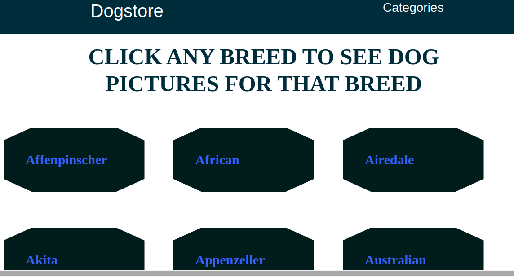

# Project Name

> The project is a single page dog display application built with React and Redux. The data used here was retrieved from the [dog API](https://dog.ceo/dog-api/) and stored in the Redux store. Every page, the main page and pages for each item, have a unique route within the SPA

This is a simple application where the user can access all dog images within a single category just with a click.

## Built With

- javaScript
- React
- Redux
- Node js
- Heroku

## Live Demo

[Live Demo Link](https://dogstorebreed.herokuapp.com/)

[Video Link](https://www.loom.com/share/8297f0e0cb584c148f11318ba9799783)

## Getting Started

Here are the steps to follow in order to get this project on your local computer.

### Prerequisites

`node v12.16.3 +`

`npm v6.14.4 +`

### Setup

clone this repo by typing `git clone`

### Install

install the dependacies by typing `npm install`

### Usage

start the local server by running `npm start`

### Deployment

this project is deployed on heroku

to get the deployment build of the code run `npm run build`

## Author

👤 **Selma ndi**

- Github: [@githubhandle](https://github.com/Datagirlcmr)
- Twitter: [@twitterhandle](https://twitter.com/SelmaNdi)
- Linkedin: [linkedin](https://www.linkedin.com/in/selma-ndi-datagirl-imba-8976ab32/)

## 🤝 Contributing

Contributions, issues and feature requests are welcome!

Feel free to check the [issues page](https://github.com/Datagirlcmr/dogstore/issues).

## Show your support

Give a ⭐️ if you like this project!

## Acknowledgments

- [dog ceo api](https://dog.ceo/dog-api/)
- Hat tip to anyone whose code was used
- etc

## 📝 License

This project is [MIT](lic.url) licensed.
